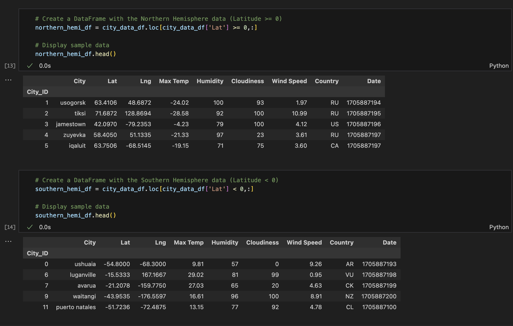
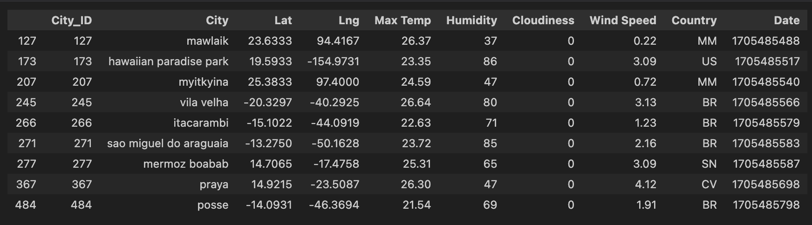

# Python-Api-Challenge :earth_africa: :world_map:

*In this assignment, I’ll create and manipulate Pandas :panda_face: DataFrames, Python :snake: requests, APIs :key:, and JSON travelsals to explore weather conditions on the equator.*
# Background
Data's true power is its ability to definitively answer questions. So, let's take what you've learned about Python requests, APIs, and JSON traversals to answer a fundamental question: "What is the weather like as we approach the equator?"

Now, we know what you may be thinking: “That’s obvious. It gets hotter.” But, if pressed for more information, how would you prove that?

### Part 1: WeatherPy
#### Objectives
In this deliverable, I'll create a Python script to visualise the weather of over 500 cities of varying distances from the equator. You'll use the citipy Python library, the OpenWeatherMap API, and my problem-solving skills to create a representative model of weather across cities.

##### Data Preparation and  Tasks

##### Requirement 1
For the first requirement I used OpenWeatherMap API to retreive weather data from cities list generated in the starter code:

Then visualise the following:

* Scatter plot ilustrating relation between Latitude vs. Temperature

* Scatter plot ilustrating relation between Latitude vs. Humidity

* Scatter plot ilustrating relation between Latitude vs. Cloudiness

* Scatter plot ilustrating relation between Latitude vs. Wind Speed

##### Requirement 2

To fullfit the second requirement it was neccessary to compute linear regression for each relationship. Separate plots into Northern Hemisphere (greater than or equal to 0 degrees latitude) and Southern Hemisphere (less than 0 degrees latitude).

* I have defined a function in order to create the linear regression plots. 

* Afterwards, I have separated DataFrames for Northern and Southern Hempishpere.

Then, I have created a series of plots visualising the following relationships:

* Nothern Hemisphere: Temperature (C) vs. Latitude

* Southern Hemisphere: Temperature (C) vs. Latitude

* Northern Hemisphere: Humidity (%) vs. Latitude

* Southern Hemisphere: Humidity (%) vs. Latitude

* Northern Hemisphere: Cloudiness (%) vs. Latitude

* Southern Hemisphere: Cloudiness (%) vs. Latitude

* Northern Hemisphere: Wind Speed (m/s) vs. Latitude

* Southern Hemisphere: Wind Speed (m/s) vs. Latitude

Finally, I have analysed each of the plots to elucidate the relationships among the requested values.

### Part 2: VacationPy

In this deliverable, you'll use your weather data skills to plan future vacations. Also, you'll use Jupyter notebooks, the geoViews Python library, and the Geoapify API.
Main tasks will be to use the Geoapify API and the geoViews Python library and employ your Python skills to create map visualisations.

To succeed on this deliverable of the assignment I had to complete the following steps: 

* Create a map that displays a point for every city in the city_data_df DataFrame. The point size is supposed to ilustrate the humidity in each city.

* Narrow down the City DataFrame to find the ideal weather condition as per example:
        A max temperature lower than 27 degrees but higher than 21
        Wind speed less than 4.5 m/s
        Zero cloudiness

* Created a new DataFrame hotels_df to store the city, country, coordinates, and humidity.

* For each city, used Geoapify API to find the first hotel located within 10,000 meters of my coordinates adding the hotel name and the country as additional information in the hover message for each city in the displayed map.

#### Technologies used
* *Visual Studio Code - **Python** Software*
* *Excel* 
* *GitHub* 
* **Pandas**
* **Jupyter Notebook**
* **Matplotlib**
* **API Key**

#### File list
* VacationPy.ipynb
* WeatherPy.ipynb
* Output_data folder with required outputs.
* Various Screen Shots

Source of the Cover SS (first file): https://www.pinterest.com.au/pin/692780355159116630/
